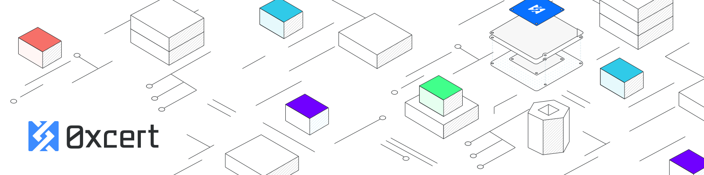

[0xCert](https://0xcert.org) is an open source, permission-less protocol for certified non-fungible
tokens on the blockchain. It provides a framework with a set of on-chain and off-chain rules with an advanced integration layer for different dapps and relay applications. A full description of the protocol in available in our [whitepaper](https://0xcert.org/whitepaper.pdf).

This repository is the main entry point to the 0xcert open-source community. It includes the specs, the core documentation files and links to all related 0xcert projects and libraries. 

## Usage

Dedicated documentation pages:

* [Usage basics](/)
  * [Getting started](/)
  * [Platform overview](/)
  * [Using digital wallets](/)
  * [Explorer features](/)
* [Become an issuer](/)
  * [Who is an issuer](/)
  * [What are the obligations](/)
  * [Creating smart contracts](/)
  * [Smart contract deployment](/)
* [Minting tokens](/)
  * [How it works](/)
  * [Using conventions](/)
  * [Token features](/)
  * [Minting process](/)
* [Transfering tokens](/)
  * [How it works](/)
  * [Transfer and trade](/)

## Projects

Every 0xcert project has a dedicated repository which also includes its own API documentation and resources. Below is a list of the official 0xcert repositories.

| Project | Description
|-|-
| [ethereum](https://github.com/0xcert/ethereum) | 0xcert protocol implementation for Ethereum blockchain.
| [whitepaper](https://github.com/0xcert/whitepaper) | 0xcert protocol technical document.
| [ethereum-tx-parser](https://github.com/0xcert/ethereum-tx-parser) | 0xcert protocol Ethereum blockchain transactions parser.
| [ethereum-tx-scaner](https://github.com/0xcert/ethereum-tx-scaner) | 0xcert protocol Ethereum blockchain transactions scanner.
| [ethereum-xcert-builder](https://github.com/0xcert/ethereum-xcert-builder) | 0xcert Xcert smart contract builder for Ethereum blockchain.
| [ethereum-xcert-parser](https://github.com/0xcert/ethereum-xcert-parser) | 0xcert protocol Xcert smart contract parser for Ethereum blockchain.
| [explorer-api](https://github.com/0xcert/explorer-api) | 0xcert explorer application API server.
| [explorer-ui](https://github.com/0xcert/explorer-ui) | 0xcert explorer application UI.

## License (MIT)

Copyright (c) 2018 0xcert <admin@0xcert.org>.
